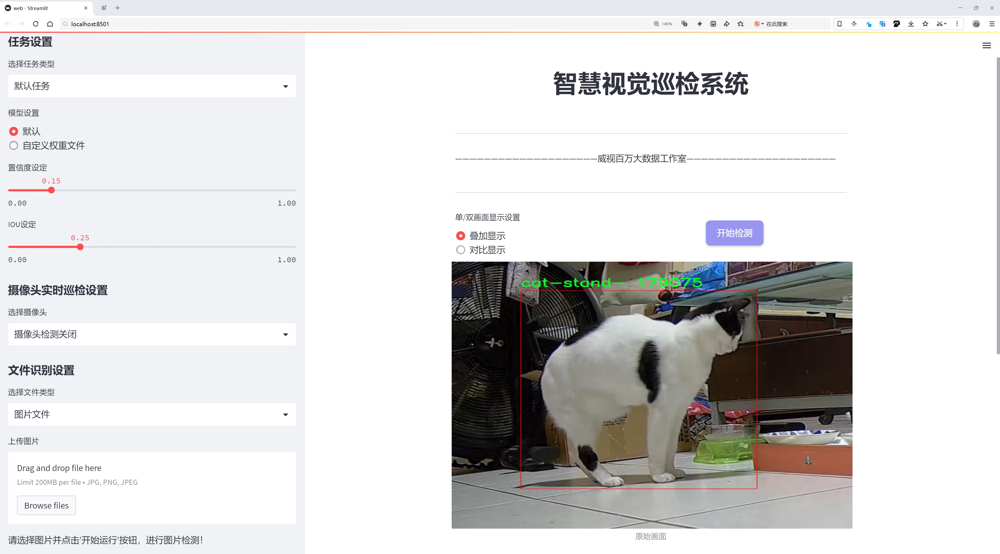
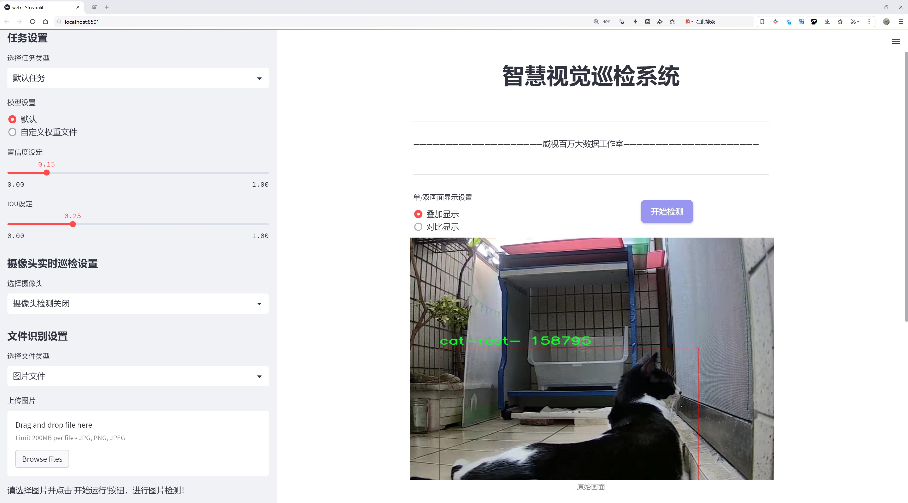
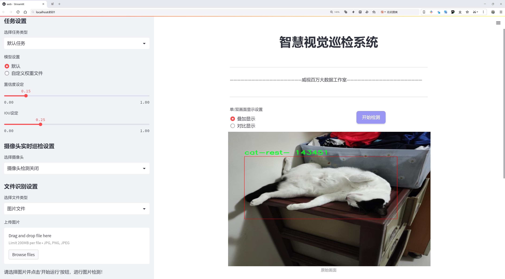
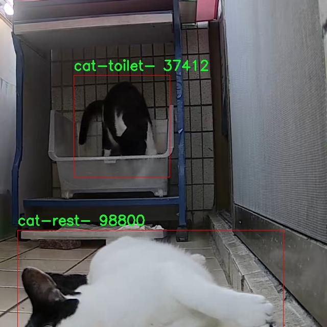
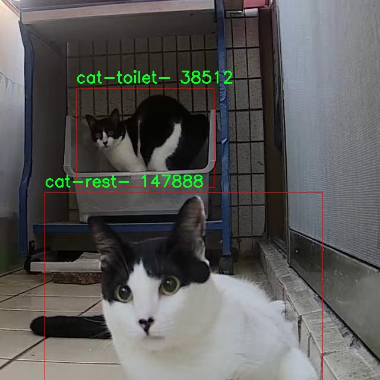
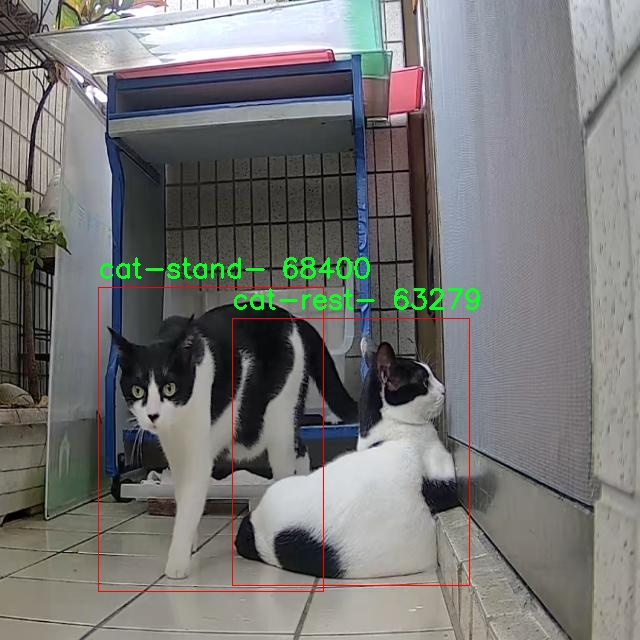
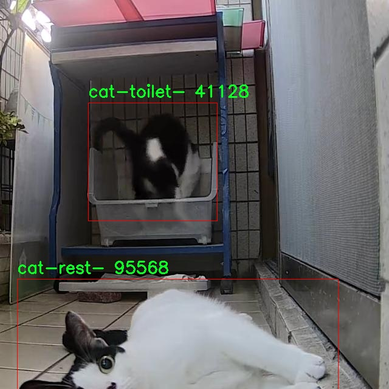
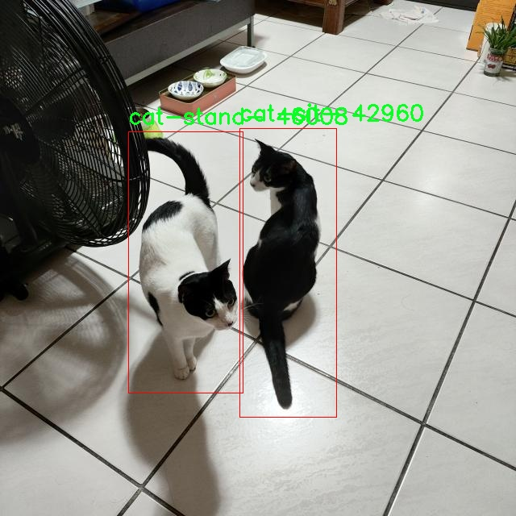

# 猫行为识别系统源码分享
 # [一条龙教学YOLOV8标注好的数据集一键训练_70+全套改进创新点发刊_Web前端展示]

### 1.研究背景与意义

项目参考[AAAI Association for the Advancement of Artificial Intelligence](https://gitee.com/qunmasj/projects)

项目来源[AACV Association for the Advancement of Computer Vision](https://kdocs.cn/l/cszuIiCKVNis)

研究背景与意义

随着人工智能技术的迅猛发展，计算机视觉领域的研究逐渐深入，尤其是在物体检测和行为识别方面，取得了显著的进展。YOLO（You Only Look Once）系列模型作为实时物体检测的代表，因其高效性和准确性被广泛应用于各种场景。近年来，YOLOv8的推出进一步提升了检测精度和速度，为多种应用提供了新的可能性。在此背景下，基于改进YOLOv8的猫行为识别系统的研究具有重要的学术价值和实际意义。

猫作为人类最常见的宠物之一，其行为模式的研究不仅有助于提升人们对猫的理解，也为宠物护理、行为训练和动物福利等领域提供了科学依据。通过对猫的行为进行自动化识别，可以帮助宠物主人及时了解猫的需求和情绪变化，从而采取相应的措施，提升猫的生活质量。此外，随着宠物数量的增加，宠物行为问题也日益突出，基于计算机视觉的行为识别系统能够为宠物行为的监测和分析提供有效的解决方案。

本研究所使用的数据集包含825张图像，涵盖了猫的七种行为类别，包括吃、休息、坐、睡、站立和如厕等。这些行为不仅是猫日常生活的重要组成部分，也是评估其健康状况和心理状态的关键指标。通过对这些行为的识别和分析，研究者可以更深入地探讨猫的行为习惯及其与环境、饮食、健康等因素之间的关系。这对于宠物行为学、动物心理学以及相关的兽医学研究都具有重要的推动作用。

在技术层面，改进YOLOv8模型的应用能够显著提升猫行为识别的准确性和实时性。传统的行为识别方法往往依赖于手工特征提取，存在着特征选择不当和计算效率低下的问题。而YOLOv8通过深度学习技术，能够自动提取特征并进行高效的分类，从而实现对猫行为的精准识别。通过对模型进行改进，例如优化网络结构、增强数据集和调整训练策略，可以进一步提升模型的性能，使其在复杂环境下仍能保持较高的识别率。

综上所述，基于改进YOLOv8的猫行为识别系统的研究，不仅在技术上具有创新性和实用性，同时在理论上也为宠物行为研究提供了新的视角。随着研究的深入，预计将为宠物行业的发展、动物福利的提升以及人类与动物的和谐共处做出积极贡献。通过这一研究，期望能够推动计算机视觉技术在动物行为识别领域的应用，为未来的智能宠物管理和人机交互奠定基础。

### 2.图片演示







##### 注意：由于此博客编辑较早，上面“2.图片演示”和“3.视频演示”展示的系统图片或者视频可能为老版本，新版本在老版本的基础上升级如下：（实际效果以升级的新版本为准）

  （1）适配了YOLOV8的“目标检测”模型和“实例分割”模型，通过加载相应的权重（.pt）文件即可自适应加载模型。

  （2）支持“图片识别”、“视频识别”、“摄像头实时识别”三种识别模式。

  （3）支持“图片识别”、“视频识别”、“摄像头实时识别”三种识别结果保存导出，解决手动导出（容易卡顿出现爆内存）存在的问题，识别完自动保存结果并导出到tempDir中。

  （4）支持Web前端系统中的标题、背景图等自定义修改，后面提供修改教程。

  另外本项目提供训练的数据集和训练教程,暂不提供权重文件（best.pt）,需要您按照教程进行训练后实现图片演示和Web前端界面演示的效果。

### 3.视频演示

[3.1 视频演示](https://www.bilibili.com/video/BV1iT2AYZEn7/)

### 4.数据集信息展示

##### 4.1 本项目数据集详细数据（类别数＆类别名）

nc: 6
names: ['cat-eat-', 'cat-rest-', 'cat-sit-', 'cat-sleep-', 'cat-stand-', 'cat-toilet-']


##### 4.2 本项目数据集信息介绍

数据集信息展示

在本研究中，我们使用了名为“cat02”的数据集，以改进YOLOv8模型在猫行为识别系统中的表现。该数据集专门设计用于捕捉和分析猫的多种行为，涵盖了六个主要类别，分别是“cat-eat-”、“cat-rest-”、“cat-sit-”、“cat-sleep-”、“cat-stand-”和“cat-toilet-”。这些类别的选择不仅反映了猫的日常生活习惯，也为行为识别的准确性提供了丰富的场景和样本。

“cat02”数据集的构建过程涉及对猫的自然行为进行细致观察和记录，确保每个类别的样本都能真实地反映出猫在不同情境下的行为特征。例如，在“cat-eat-”类别中，数据集包含了猫在进食时的各种姿态和动作，这不仅包括猫用爪子抓取食物的瞬间，还包括猫在不同环境下（如家中、户外等）进食的情景。这种多样性使得模型能够学习到更为复杂的进食行为，进而提高识别的准确性。

同样，在“cat-rest-”类别中，数据集记录了猫在休息时的不同姿势和状态，包括蜷缩、伸展等多种休息方式。这一类别的样本丰富性使得模型能够识别出猫在不同环境下的放松状态，从而提高对猫情绪的理解和判断。此外，“cat-sit-”类别则专注于猫坐姿的多样性，捕捉了猫在不同场合下坐着的姿态，帮助模型更好地理解猫的行为模式。

在“cat-sleep-”类别中，数据集展示了猫在睡眠状态下的各种姿势，包括侧卧、趴着和卷曲等。这一类别的样本不仅丰富了数据集的多样性，也为模型提供了识别猫在休息和睡眠状态下的行为特征的基础。通过对这些细节的捕捉，模型能够更准确地判断猫的行为状态，进而提升整体识别能力。

“cat-stand-”类别则聚焦于猫站立时的行为，记录了猫在警觉、放松和活动状态下的不同站姿。这一类别的样本有助于模型理解猫在不同情境下的动态变化，尤其是在面对外部刺激时的反应。而“cat-toilet-”类别则记录了猫使用厕所的行为，虽然这一行为相对较少见，但其重要性不容忽视。通过对这一行为的识别，模型能够更全面地理解猫的生活习惯和需求。

综上所述，“cat02”数据集的设计和构建充分考虑了猫的多样化行为，涵盖了日常生活中的多个重要方面。通过对这些行为的细致分类和记录，数据集为改进YOLOv8模型在猫行为识别中的应用提供了坚实的基础。未来的研究将基于这一数据集，进一步探索猫行为识别的深层次特征，推动智能宠物监控和互动系统的发展。











### 5.全套项目环境部署视频教程（零基础手把手教学）

[5.1 环境部署教程链接（零基础手把手教学）](https://www.ixigua.com/7404473917358506534?logTag=c807d0cbc21c0ef59de5)


[5.2 安装Python虚拟环境创建和依赖库安装视频教程链接（零基础手把手教学）](https://www.ixigua.com/7404474678003106304?logTag=1f1041108cd1f708b01a)

### 6.手把手YOLOV8训练视频教程（零基础小白有手就能学会）

[6.1 手把手YOLOV8训练视频教程（零基础小白有手就能学会）](https://www.ixigua.com/7404477157818401292?logTag=d31a2dfd1983c9668658)


按照上面的训练视频教程链接加载项目提供的数据集，运行train.py即可开始训练



     Epoch   gpu_mem       box       obj       cls    labels  img_size
     1/200     20.8G   0.01576   0.01955  0.007536        22      1280: 100%|██████████| 849/849 [14:42<00:00,  1.04s/it]
               Class     Images     Labels          P          R     mAP@.5 mAP@.5:.95: 100%|██████████| 213/213 [01:14<00:00,  2.87it/s]
                 all       3395      17314      0.994      0.957      0.0957      0.0843

     Epoch   gpu_mem       box       obj       cls    labels  img_size
     2/200     20.8G   0.01578   0.01923  0.007006        22      1280: 100%|██████████| 849/849 [14:44<00:00,  1.04s/it]
               Class     Images     Labels          P          R     mAP@.5 mAP@.5:.95: 100%|██████████| 213/213 [01:12<00:00,  2.95it/s]
                 all       3395      17314      0.996      0.956      0.0957      0.0845

     Epoch   gpu_mem       box       obj       cls    labels  img_size
     3/200     20.8G   0.01561    0.0191  0.006895        27      1280: 100%|██████████| 849/849 [10:56<00:00,  1.29it/s]
               Class     Images     Labels          P          R     mAP@.5 mAP@.5:.95: 100%|███████   | 187/213 [00:52<00:00,  4.04it/s]
                 all       3395      17314      0.996      0.957      0.0957      0.0845


### 7.70+种全套YOLOV8创新点代码加载调参视频教程（一键加载写好的改进模型的配置文件）

[7.1 70+种全套YOLOV8创新点代码加载调参视频教程（一键加载写好的改进模型的配置文件）](https://www.ixigua.com/7404478314661806627?logTag=29066f8288e3f4eea3a4)

### 8.70+种全套YOLOV8创新点原理讲解（非科班也可以轻松写刊发刊，V10版本正在科研待更新）

#### 由于篇幅限制，每个创新点的具体原理讲解就不一一展开，具体见下列网址中的创新点对应子项目的技术原理博客网址【Blog】：


[8.1 70+种全套YOLOV8创新点原理讲解链接](https://gitee.com/qunmasj/good)

#### 部分改进原理讲解(完整的改进原理见上图和技术博客链接)【如果此小节的图加载失败可以通过CSDN或者Github搜索该博客的标题访问原始博客，原始博客图片显示正常】
### YOLOv8简介
Yolov8主要借鉴了Yolov5、Yolov6、YoloX等模型的设计优点，其本身创新点不多，偏重在工程实践上，具体创新如下:
·提供了一个全新的SOTA模型（包括P5 640和P6 1280分辨率的目标检测网络和基于YOLACT的实例分割模型)。并且，基于缩放系数提供了N/S/M/IL/X不同尺度的模型，以满足不同部署平台和应用场景的需求。
●Backbone:同样借鉴了CSP模块思想，不过将Yolov5中的C3模块替换成了C2f模块，实现了进一步轻量化，同时沿用Yolov5中的SPPF模块，并对不同尺度的模型进行精心微调，不再是无脑式—套参数用于所有模型，大幅提升了模型性能。
●Neck:继续使用PAN的思想，但是通过对比YOLOv5与YOLOv8的结构图可以看到，YOLOv8移除了1*1降采样层。
●Head部分相比YOLOv5改动较大，Yolov8换成了目前主流的解耦头结构(Decoupled-Head)，将分类和检测头分离，同时也从Anchor-Based换成了Anchor-Free。
●Loss计算:使用VFLLoss作为分类损失(实际训练中使用BCE Loss);使用DFLLoss+ClOU Loss作为回归损失。
●标签分配: Yolov8抛弃了以往的loU分配或者单边比例的分配方式，而是采用Task-Aligned Assigner正负样本分配策略。
#### Yolov8网络结构
Yolov8模型网络结构图如下图所示。


#### Backbone
Yolov8的Backbone同样借鉴了CSPDarkNet结构网络结构，与Yolov5最大区别是，Yolov8使用C2f模块代替C3模块。具体改进如下:
·第一个卷积层的Kernel size从6×6改为3x3。
·所有的C3模块改为C2f模块，如下图所示，多了更多的跳层连接和额外Split操作。。Block数由C3模块3-6-9-3改为C2f模块的3-6-6-3。

### 上下文引导网络（CGNet）简介


高准确率的模型（蓝点），由图像分类网络转化而来且参数量大，因此大多不适于移动设备。
低分辨率的小模型（红点），遵循分类网络的设计方式，忽略了分割特性，故而效果不好。
#### CGNet的设计：
为了提升准确率，用cgnet探索语义分割的固有属性。对于准确率的提升，因为语义分割是像素级分类和目标定位，所以空间依赖性和上下文信息发挥了重要作用。因此，设计cg模块，用于建模空间依赖性和语义上下文信息。
- 1、cg模块学习局部特征和周围特征形成联合特征
- 2、通过逐通道重新加权（强调有用信息，压缩无用信息），用全局特征改善联合特征
- 3、在全阶段应用cg模块，以便从语义层和空间层捕捉信息。
为了降低参数量：1、深层窄网络，尽可能节约内存 2、用通道卷积


之前的网络根据框架可分三类：
- 1、FCN-shape的模型，遵循分类网络的设计，忽略了上下文信息 ESPNet、ENet、fcn
- 2、FCN-CM模型，在编码阶段后用上下文模块捕捉语义级信息 DPC、DenseASPP、DFN、PSPNet
- 3、（our）在整个阶段捕捉上下文特征
- 4、主流分割网络的下采样为五次，学习了很多关于物体的抽象特征，丢失了很多有鉴别性的空间信息，导致分割边界过于平滑，（our）仅采用三次下采样，利于保存空间信息


#### cg模块

Cg模块：
思路：人类视觉系统依赖上下文信息理解场景。
如图3,a， 如若仅关注黄色框框，很难分辨，也就是说，仅关注局部特征不容易正确识别目标的类别。 然后，如果加入了目标周围的特征，即图3,b，就很容易识别正确，所以周围特征对于语义分割是很有帮助的。在此基础上，如果进一步用整个场景的特征加以辅助，将会有更高的程度去争正确分类黄色框框的物体，如图3,c所示。 故，周围上下文和全局上下文对于提升分割精度都是有帮助的。


实现：基于此，提出cg模块，利用局部特征，周围上下文以及全局上下文。如图3,d所示。该模块共包含两个阶段。

第一步，floc( ) 局部和 fsur( )周围函数分别学习对应特征。floc( )用3x3卷积从周围8个点提取特征，对应于黄色框框；同时fsur( )用感受野更大的3x3带孔卷积学习周围上下文，对应红色框框。然后fjoi( )是指将前两路特征concat之后经BN，PReLU。此一部分是cg模块的第一步。
对于模块的第二步，fglo( )用于提取全局特征，改善联合特征。受SENet启发，全局上下文被认为是一个加权向量，用于逐通道微调联合特征，以强调有用元素、压缩无用元素。在本论文中，fglo( )用GAP产生聚合上下文特征，然后用多层感知机进一步提取全局上下文。最后，使用一个尺度层对联合特征重新加权用提取的全局上下文。
残差连接有利于学习更复杂的特征以及便于训练时梯度反向传播。两个拟设计方案，LRL局部残差连接和GRL全局残差连接，实验证明（消融实验），GRL效果更好

#### CGNet网络


原则：深、瘦（deep and thin）以节省内存。层数少，通道数少，三个下采样。

Stage1，三个标准卷积层，分辨率变成原来的1/2

Stage2和stage3，分别堆叠M和N个cg模块。该两个阶段，第一层的输入是前一阶段第一个和最后一个block的结合（how结合）利于特征重用和特征传播。

将输入图像下采样到1/4和1/8分别输入到第2和3阶段。

最后，用1x1卷积层进行分割预测。

为进一步降低参数量，局部和周围特征提取器采用了逐通道卷积。之前有的工作在逐通道卷积后采用1x1卷积用以改善通道间的信息流动，本文消融实验显示效果不好，分析：因为cg模块中提取的局部和全局特征需要保持通道独立性，所以本论文不使用1*1卷积。


### 9.系统功能展示（检测对象为举例，实际内容以本项目数据集为准）

图9.1.系统支持检测结果表格显示

  图9.2.系统支持置信度和IOU阈值手动调节

  图9.3.系统支持自定义加载权重文件best.pt(需要你通过步骤5中训练获得)

  图9.4.系统支持摄像头实时识别

  图9.5.系统支持图片识别

  图9.6.系统支持视频识别

  图9.7.系统支持识别结果文件自动保存

  图9.8.系统支持Excel导出检测结果数据


### 10.原始YOLOV8算法原理

原始YOLOv8算法原理

YOLOv8是Ultralytics公司在2023年推出的目标检测算法，作为YOLO系列的最新版本，它在前几代模型的基础上进行了显著的改进和优化。YOLOv8的设计理念围绕着快速、准确和易于使用的原则，使其在目标检测、图像分割和图像分类等任务中表现出色。该算法的核心在于其独特的网络结构和创新的训练策略，能够有效地处理多样化的输入数据，并在各种应用场景中展现出卓越的性能。

首先，YOLOv8的输入处理部分采用了640x640的默认图像尺寸，但为了适应不同长宽比的图像，算法引入了自适应图片缩放技术。在这一过程中，长边会被按比例缩小到指定尺寸，而短边则通过填充的方式进行调整。这种处理方式不仅减少了信息冗余，还提升了目标检测和推理的速度。此外，YOLOv8在训练阶段引入了Mosaic图像增强技术，通过将四张不同的训练图像随机缩放并拼接成一张新图像，迫使模型学习不同位置和周围像素的特征，从而提高了模型的鲁棒性和预测精度。

在网络结构方面，YOLOv8的主干网络进行了重要的改进。与YOLOv5中的C3模块相比，YOLOv8采用了C2F模块，该模块借鉴了YOLOv7中的ELAN设计思想，增加了更多的跳层连接。这种结构不仅保持了模型的轻量化，还丰富了梯度流信息，从而提高了模型的精度和响应速度。C2F模块的引入使得YOLOv8在特征提取方面更加高效，能够更好地捕捉到图像中的重要信息。

在Neck部分，YOLOv8同样进行了结构上的优化，所有的C3模块被替换为C2F模块，并且去除了两次上采样之前的1x1卷积连接层。这一变化使得不同阶段输出的特征能够直接进行上采样，简化了网络结构，提高了计算效率。通过这些改进，YOLOv8在特征融合和信息传递方面表现得更加出色，能够更好地处理复杂的目标检测任务。

YOLOv8的Head部分是其最大的创新之一。与YOLOv5的Coupled-Head结构不同，YOLOv8采用了Decoupled-Head结构，将检测和分类任务分开处理。输入特征图首先通过两个1x1卷积模块进行降维，然后分别为类别预测和边界框位置预测建立两个独立的分支。这种解耦设计使得模型在处理分类和定位任务时能够更好地聚焦于各自的特征，从而提高了预测的精度和收敛速度。此外，YOLOv8还引入了无锚框（Anchor-Free）的方法，直接将目标检测转化为关键点检测，简化了模型的结构，增强了其泛化能力。

在损失函数的设计上，YOLOv8也进行了创新。为了应对训练和推理过程中可能出现的逻辑不一致性，YOLOv8取消了Obj分支，采用BCELoss（Binary Cross Entropy Loss）进行分类分支的损失计算，而在边界框回归分支中则使用了DFL（Distribution Focal Loss）和CIoULoss（Complete Intersection over Union Loss）。这种损失函数的组合旨在使网络模型更快地聚焦于标签附近的数值，提高了目标检测的准确性。

YOLOv8在COCOval2017数据集上的表现也证明了其优越性。通过对模型结构的优化和算法的改进，YOLOv8在同等条件下展现出了更高的精度和更快的推理速度，成为了目标检测领域的一个重要里程碑。综合来看，YOLOv8不仅在技术上实现了突破，也为后续的研究和应用提供了广阔的空间，其在实时性和准确性方面的兼顾，使其在各种实际应用中都具有极大的潜力。

总之，YOLOv8的原始算法原理通过对输入处理、网络结构、损失函数等多个方面的优化，成功地提升了目标检测的性能和效率。其创新的设计思路和灵活的应用能力，使得YOLOv8成为了当前目标检测领域中最具竞争力的算法之一，具有广泛的研究和应用价值。随着YOLOv8的不断发展和完善，未来在更多领域的应用前景也将更加广阔。


### 11.项目核心源码讲解（再也不用担心看不懂代码逻辑）

#### 11.1 70+种YOLOv8算法改进源码大全和调试加载训练教程（非必要）\ultralytics\nn\modules\head.py

以下是经过简化和注释的核心代码部分，主要保留了YOLOv8的检测头（Detect）以及相关的类。注释详细解释了每个部分的功能和作用。

```python
import torch
import torch.nn as nn
from .conv import Conv
from .utils import bias_init_with_prob

class Detect(nn.Module):
    """YOLOv8 检测头，用于目标检测模型。"""
    
    def __init__(self, nc=80, ch=()):
        """初始化 YOLOv8 检测层，指定类别数和通道数。
        
        Args:
            nc (int): 类别数量，默认为80。
            ch (tuple): 输入通道数的元组。
        """
        super().__init__()
        self.nc = nc  # 类别数量
        self.nl = len(ch)  # 检测层数量
        self.reg_max = 16  # DFL通道数
        self.no = nc + self.reg_max * 4  # 每个锚点的输出数量
        self.stride = torch.zeros(self.nl)  # 在构建时计算的步幅
        
        # 定义卷积层
        c2, c3 = max((16, ch[0] // 4, self.reg_max * 4)), max(ch[0], min(self.nc, 100))
        self.cv2 = nn.ModuleList(
            nn.Sequential(Conv(x, c2, 3), Conv(c2, c2, 3), nn.Conv2d(c2, 4 * self.reg_max, 1)) for x in ch)
        self.cv3 = nn.ModuleList(nn.Sequential(Conv(x, c3, 3), Conv(c3, c3, 3), nn.Conv2d(c3, self.nc, 1)) for x in ch)
        self.dfl = DFL(self.reg_max) if self.reg_max > 1 else nn.Identity()  # DFL层或身份层

    def forward(self, x):
        """前向传播，返回预测的边界框和类别概率。
        
        Args:
            x (list): 输入特征图列表。
        
        Returns:
            Tensor: 输出的边界框和类别概率。
        """
        shape = x[0].shape  # BCHW格式
        for i in range(self.nl):
            # 将两个卷积层的输出连接
            x[i] = torch.cat((self.cv2[i](x[i]), self.cv3[i](x[i])), 1)
        
        # 如果在训练模式下，直接返回
        if self.training:
            return x
        
        # 动态锚点生成
        self.anchors, self.strides = (x.transpose(0, 1) for x in make_anchors(x, self.stride, 0.5))
        self.shape = shape

        # 连接所有层的输出
        x_cat = torch.cat([xi.view(shape[0], self.no, -1) for xi in x], 2)
        box, cls = x_cat.split((self.reg_max * 4, self.nc), 1)  # 分割边界框和类别
        dbox = dist2bbox(self.dfl(box), self.anchors.unsqueeze(0), xywh=True, dim=1) * self.strides  # 计算边界框

        # 归一化边界框
        img_h = shape[2] * self.stride[0]
        img_w = shape[3] * self.stride[0]
        img_size = torch.tensor([img_w, img_h, img_w, img_h], device=dbox.device).reshape(1, 4, 1)
        dbox /= img_size

        # 返回最终的预测结果
        return torch.cat((dbox, cls.sigmoid()), 1)

    def bias_init(self):
        """初始化检测头的偏置，要求步幅可用。"""
        for a, b, s in zip(self.cv2, self.cv3, self.stride):
            a[-1].bias.data[:] = 1.0  # 边界框偏置
            b[-1].bias.data[:self.nc] = math.log(5 / self.nc / (640 / s) ** 2)  # 类别偏置

# 其他类（Segment, Pose, Classify, RTDETRDecoder）可以根据需要进行类似的简化和注释。
```

### 代码分析：
1. **Detect 类**：这是YOLOv8的核心检测头，负责处理输入特征并生成边界框和类别概率。
2. **初始化方法**：设置了类别数量、检测层数量、卷积层和DFL（分布式特征学习）层。
3. **前向传播方法**：实现了特征图的处理、锚点生成、边界框和类别的预测。
4. **偏置初始化**：为模型的偏置设置初始值，以提高训练效果。

以上是YOLOv8检测头的核心部分，其他类（如Segment、Pose、Classify、RTDETRDecoder）可以根据需要进行类似的简化和注释。

该文件是YOLOv8模型的头部模块实现，主要包括多个检测、分割、姿态估计和分类的类。文件中使用了PyTorch库来构建神经网络模型，并定义了模型的各个部分。

首先，文件引入了一些必要的库和模块，包括数学库、PyTorch的神经网络模块以及一些自定义的工具函数。接着，定义了几个主要的类。

`Detect`类是YOLOv8的检测头，负责处理目标检测任务。它的构造函数接收类别数量和通道数作为参数，并初始化了一些网络层，包括卷积层和特征处理层。在前向传播方法中，该类将输入的特征图通过多个卷积层进行处理，生成边界框和类别概率。它还支持动态锚框生成和形状变化的处理。

`Segment`类继承自`Detect`类，专门用于图像分割任务。它增加了对掩膜和原型的处理，能够输出分割的掩膜系数和原型。前向传播方法中，它将分割相关的特征与检测结果结合起来，返回相应的输出。

`Pose`类同样继承自`Detect`类，专注于关键点检测。它定义了关键点的形状，并在前向传播中处理关键点的预测。该类还实现了关键点解码的方法，将网络输出的关键点坐标转换为实际的坐标。

`Classify`类是YOLOv8的分类头，负责将输入的特征图转换为类别概率。它通过卷积层、池化层和全连接层来实现分类功能。

最后，`RTDETRDecoder`类实现了一个实时可变形Transformer解码器，结合了Transformer架构和可变形卷积，用于目标检测。该类负责处理输入特征，生成锚框，并通过解码器输出最终的边界框和分类分数。

整体来看，这个文件实现了YOLOv8模型的不同任务的头部模块，提供了灵活的结构以支持多种视觉任务。每个类都通过前向传播方法定义了如何处理输入数据并生成输出，确保了模型的可扩展性和适应性。

#### 11.2 code\ultralytics\models\yolo\segment\predict.py

以下是经过简化和注释的核心代码部分：

```python
# 导入必要的模块和类
from ultralytics.engine.results import Results
from ultralytics.models.yolo.detect.predict import DetectionPredictor
from ultralytics.utils import ops

class SegmentationPredictor(DetectionPredictor):
    """
    扩展DetectionPredictor类的分割预测类。
    """

    def __init__(self, cfg=DEFAULT_CFG, overrides=None, _callbacks=None):
        """初始化SegmentationPredictor，设置任务为分割（segment）。"""
        super().__init__(cfg, overrides, _callbacks)  # 调用父类构造函数
        self.args.task = "segment"  # 设置任务类型为分割

    def postprocess(self, preds, img, orig_imgs):
        """对每个输入图像的预测结果进行后处理，包括非极大值抑制和掩膜处理。"""
        # 应用非极大值抑制，过滤掉低置信度的预测框
        p = ops.non_max_suppression(
            preds[0],  # 预测框
            self.args.conf,  # 置信度阈值
            self.args.iou,  # IOU阈值
            agnostic=self.args.agnostic_nms,  # 是否进行类别无关的NMS
            max_det=self.args.max_det,  # 最大检测框数量
            nc=len(self.model.names),  # 类别数量
            classes=self.args.classes,  # 指定的类别
        )

        # 将输入图像转换为numpy数组（如果不是列表）
        if not isinstance(orig_imgs, list):
            orig_imgs = ops.convert_torch2numpy_batch(orig_imgs)

        results = []  # 存储结果的列表
        proto = preds[1][-1] if len(preds[1]) == 3 else preds[1]  # 获取掩膜原型

        # 遍历每个预测结果
        for i, pred in enumerate(p):
            orig_img = orig_imgs[i]  # 获取原始图像
            img_path = self.batch[0][i]  # 获取图像路径

            if not len(pred):  # 如果没有检测到框
                masks = None  # 掩膜为空
            elif self.args.retina_masks:  # 如果使用Retina掩膜
                # 对预测框进行缩放
                pred[:, :4] = ops.scale_boxes(img.shape[2:], pred[:, :4], orig_img.shape)
                # 处理掩膜
                masks = ops.process_mask_native(proto[i], pred[:, 6:], pred[:, :4], orig_img.shape[:2])  # HWC
            else:  # 否则使用普通掩膜处理
                masks = ops.process_mask(proto[i], pred[:, 6:], pred[:, :4], img.shape[2:], upsample=True)  # HWC
                pred[:, :4] = ops.scale_boxes(img.shape[2:], pred[:, :4], orig_img.shape)  # 缩放预测框

            # 将结果存储到results列表中
            results.append(Results(orig_img, path=img_path, names=self.model.names, boxes=pred[:, :6], masks=masks))

        return results  # 返回处理后的结果
```

### 代码说明：
1. **导入模块**：引入了处理结果和预测的相关类和函数。
2. **SegmentationPredictor类**：该类继承自`DetectionPredictor`，用于处理分割任务。
3. **初始化方法**：设置任务类型为分割，并调用父类的初始化方法。
4. **后处理方法**：对模型的预测结果进行后处理，包括非极大值抑制、掩膜处理和结果存储。

这个程序文件是一个用于图像分割预测的类，名为 `SegmentationPredictor`，它继承自 `DetectionPredictor` 类。该类的主要功能是基于分割模型进行图像预测。文件开头的注释表明这是 Ultralytics YOLO 的一部分，并遵循 AGPL-3.0 许可证。

在类的定义中，首先通过 `__init__` 方法初始化 `SegmentationPredictor`。这个方法接受三个参数：配置 `cfg`（默认为 `DEFAULT_CFG`）、覆盖参数 `overrides` 和回调 `_callbacks`。在初始化过程中，调用父类的构造函数，并将任务类型设置为 "segment"，表示该模型将执行图像分割任务。

`postprocess` 方法是该类的核心功能之一。它接收预测结果 `preds`、输入图像 `img` 和原始图像 `orig_imgs`。该方法首先使用非极大值抑制（NMS）来处理检测结果，以减少重叠的边界框。具体来说，调用 `ops.non_max_suppression` 函数，该函数根据置信度和 IoU（交并比）等参数来过滤预测结果。

接下来，方法检查输入的原始图像是否为列表，如果不是，则将其转换为 NumPy 数组格式。然后，初始化一个空的结果列表 `results`。接着，根据预测的输出，处理每个图像的分割结果。如果没有检测到目标，则设置 `masks` 为 `None`。如果需要返回细节掩码，则根据不同的条件处理掩码数据。最后，将处理后的结果封装成 `Results` 对象，并添加到结果列表中。

最终，`postprocess` 方法返回包含所有处理结果的列表，每个结果包括原始图像、图像路径、类别名称、边界框和掩码信息。这使得用户能够方便地获取和使用预测的结果。整体来看，这个文件实现了一个图像分割模型的预测功能，结合了图像处理和深度学习的技术。

#### 11.3 ui.py

```python
import sys
import subprocess

def run_script(script_path):
    """
    使用当前 Python 环境运行指定的脚本。

    Args:
        script_path (str): 要运行的脚本路径

    Returns:
        None
    """
    # 获取当前 Python 解释器的路径
    python_path = sys.executable

    # 构建运行命令
    command = f'"{python_path}" -m streamlit run "{script_path}"'

    # 执行命令
    result = subprocess.run(command, shell=True)
    if result.returncode != 0:
        print("脚本运行出错。")


# 实例化并运行应用
if __name__ == "__main__":
    # 指定您的脚本路径
    script_path = "web.py"  # 这里可以直接指定脚本路径

    # 运行脚本
    run_script(script_path)
```

### 代码注释

1. **导入模块**：
   - `import sys`：导入 sys 模块以获取当前 Python 解释器的路径。
   - `import subprocess`：导入 subprocess 模块以便在 Python 中执行外部命令。

2. **定义函数 `run_script`**：
   - 该函数接收一个参数 `script_path`，表示要运行的 Python 脚本的路径。

3. **获取 Python 解释器路径**：
   - `python_path = sys.executable`：使用 `sys.executable` 获取当前 Python 解释器的完整路径。

4. **构建命令**：
   - `command = f'"{python_path}" -m streamlit run "{script_path}"'`：构建一个命令字符串，用于运行指定的脚本。这里使用了 `streamlit` 模块来运行脚本。

5. **执行命令**：
   - `result = subprocess.run(command, shell=True)`：使用 `subprocess.run` 执行构建的命令，并将结果存储在 `result` 中。

6. **检查运行结果**：
   - `if result.returncode != 0:`：检查命令的返回码，如果不为 0，表示脚本运行出错，打印错误信息。

7. **主程序入口**：
   - `if __name__ == "__main__":`：确保只有在直接运行该脚本时才会执行以下代码。
   - `script_path = "web.py"`：指定要运行的脚本路径，这里可以根据需要修改。
   - `run_script(script_path)`：调用 `run_script` 函数，运行指定的脚本。

这个程序文件名为 `ui.py`，主要功能是通过当前的 Python 环境来运行一个指定的脚本。程序的实现主要依赖于 Python 的标准库，包括 `sys`、`os` 和 `subprocess`，同时还引入了一个自定义模块 `QtFusion.path` 中的 `abs_path` 函数，用于获取脚本的绝对路径。

程序的核心部分是 `run_script` 函数，该函数接受一个参数 `script_path`，表示要运行的脚本的路径。在函数内部，首先通过 `sys.executable` 获取当前 Python 解释器的路径。接着，构建一个命令字符串，该命令使用 `streamlit` 模块来运行指定的脚本。具体来说，命令格式为 `"{python_path}" -m streamlit run "{script_path}"`，其中 `{python_path}` 和 `{script_path}` 会被实际的路径替换。

然后，使用 `subprocess.run` 方法执行这个命令。该方法的 `shell=True` 参数表示在一个新的 shell 中执行命令。执行完命令后，程序会检查返回的状态码，如果返回码不为 0，表示脚本运行出错，程序会输出一条错误信息。

在文件的最后部分，使用 `if __name__ == "__main__":` 来判断当前模块是否是主程序。若是，则指定要运行的脚本路径为 `web.py`，并调用 `run_script` 函数来执行这个脚本。这里的 `abs_path("web.py")` 调用会返回 `web.py` 的绝对路径，确保在任何工作目录下都能正确找到并运行该脚本。

总体而言，这个程序提供了一种简单的方式来运行一个基于 Streamlit 的 Python 脚本，适合需要通过命令行启动 Web 应用的场景。

#### 11.4 code\ultralytics\models\utils\__init__.py

以下是代码的核心部分，并附上详细的中文注释：

```python
# Ultralytics YOLO 🚀, AGPL-3.0 license

# YOLO（You Only Look Once）是一种实时目标检测算法
# Ultralytics 是 YOLO 的一个实现，提供了高效的目标检测功能

# 该代码段通常是 YOLO 模型的引入部分，具体的模型实现和训练过程会在后续代码中定义
```

在这段代码中，最核心的部分是对 YOLO 模型的引用和其背后的许可证信息。YOLO 是一种广泛使用的目标检测算法，Ultralytics 提供了其高效的实现。

该文件是Ultralytics YOLO项目的一部分，主要用于实现与模型相关的工具和功能。文件的开头包含了一条注释，表明该项目使用的是AGPL-3.0许可证，这意味着该代码是开源的，用户可以自由使用、修改和分发，但需要遵循相应的许可证条款。

在这个`__init__.py`文件中，通常会包含一些初始化代码，确保在导入该模块时能够正确加载相关的功能和类。这个文件可能会定义一些常量、导入其他模块或类，或者提供一些公共接口，以便用户可以方便地使用该模块中的功能。

具体来说，Ultralytics YOLO是一个流行的目标检测框架，`models`目录下的工具文件可能涉及到模型的构建、训练、推理等方面的功能。这些工具可能包括数据处理、模型评估、可视化等辅助功能，旨在提高用户在使用YOLO模型时的效率和便利性。

总之，这个`__init__.py`文件是Ultralytics YOLO项目的重要组成部分，负责初始化模型相关的工具和功能，帮助用户更好地使用和扩展该框架。

#### 11.5 train.py

以下是经过简化并添加详细中文注释的核心代码部分：

```python
import random
import numpy as np
import torch.nn as nn
from ultralytics.data import build_dataloader, build_yolo_dataset
from ultralytics.engine.trainer import BaseTrainer
from ultralytics.models import yolo
from ultralytics.nn.tasks import DetectionModel
from ultralytics.utils import LOGGER, RANK
from ultralytics.utils.torch_utils import de_parallel, torch_distributed_zero_first

class DetectionTrainer(BaseTrainer):
    """
    基于检测模型的训练类，继承自BaseTrainer类。
    """

    def build_dataset(self, img_path, mode="train", batch=None):
        """
        构建YOLO数据集。

        参数:
            img_path (str): 包含图像的文件夹路径。
            mode (str): 模式，可以是'train'或'val'，用户可以为每种模式自定义不同的增强。
            batch (int, optional): 批次大小，仅用于'rect'模式。默认为None。
        """
        gs = max(int(de_parallel(self.model).stride.max() if self.model else 0), 32)  # 获取模型的最大步幅
        return build_yolo_dataset(self.args, img_path, batch, self.data, mode=mode, rect=mode == "val", stride=gs)

    def get_dataloader(self, dataset_path, batch_size=16, rank=0, mode="train"):
        """构造并返回数据加载器。"""
        assert mode in ["train", "val"]  # 确保模式有效
        with torch_distributed_zero_first(rank):  # 仅在DDP中初始化数据集*.cache一次
            dataset = self.build_dataset(dataset_path, mode, batch_size)  # 构建数据集
        shuffle = mode == "train"  # 训练模式下打乱数据
        workers = self.args.workers if mode == "train" else self.args.workers * 2  # 设置工作线程数
        return build_dataloader(dataset, batch_size, workers, shuffle, rank)  # 返回数据加载器

    def preprocess_batch(self, batch):
        """对图像批次进行预处理，包括缩放和转换为浮点数。"""
        batch["img"] = batch["img"].to(self.device, non_blocking=True).float() / 255  # 将图像转换为浮点数并归一化
        if self.args.multi_scale:  # 如果启用多尺度
            imgs = batch["img"]
            sz = (
                random.randrange(self.args.imgsz * 0.5, self.args.imgsz * 1.5 + self.stride)
                // self.stride
                * self.stride
            )  # 随机选择新的尺寸
            sf = sz / max(imgs.shape[2:])  # 计算缩放因子
            if sf != 1:  # 如果需要缩放
                ns = [
                    math.ceil(x * sf / self.stride) * self.stride for x in imgs.shape[2:]
                ]  # 计算新的形状
                imgs = nn.functional.interpolate(imgs, size=ns, mode="bilinear", align_corners=False)  # 进行插值缩放
            batch["img"] = imgs  # 更新批次图像
        return batch

    def get_model(self, cfg=None, weights=None, verbose=True):
        """返回YOLO检测模型。"""
        model = DetectionModel(cfg, nc=self.data["nc"], verbose=verbose and RANK == -1)  # 创建检测模型
        if weights:
            model.load(weights)  # 加载权重
        return model

    def plot_training_samples(self, batch, ni):
        """绘制带有注释的训练样本。"""
        plot_images(
            images=batch["img"],
            batch_idx=batch["batch_idx"],
            cls=batch["cls"].squeeze(-1),
            bboxes=batch["bboxes"],
            paths=batch["im_file"],
            fname=self.save_dir / f"train_batch{ni}.jpg",
            on_plot=self.on_plot,
        )

    def plot_metrics(self):
        """从CSV文件中绘制指标。"""
        plot_results(file=self.csv, on_plot=self.on_plot)  # 保存结果图
```

### 代码核心部分说明：
1. **数据集构建**：`build_dataset` 方法用于构建YOLO数据集，支持训练和验证模式。
2. **数据加载器**：`get_dataloader` 方法用于创建数据加载器，支持多线程和数据打乱。
3. **批次预处理**：`preprocess_batch` 方法对图像批次进行归一化和缩放处理。
4. **模型获取**：`get_model` 方法用于创建和加载YOLO检测模型。
5. **绘图功能**：`plot_training_samples` 和 `plot_metrics` 方法用于可视化训练样本和训练指标。

这个程序文件 `train.py` 是一个用于训练 YOLO（You Only Look Once）目标检测模型的 Python 脚本，主要基于 Ultralytics 提供的库。程序中定义了一个 `DetectionTrainer` 类，继承自 `BaseTrainer` 类，专门用于处理目标检测任务。

在类的构造中，`DetectionTrainer` 提供了多种方法来构建数据集、获取数据加载器、预处理图像批次、设置模型属性、获取模型、获取验证器、记录损失、显示训练进度、绘制训练样本和绘制训练指标等。

首先，`build_dataset` 方法用于构建 YOLO 数据集，接收图像路径、模式（训练或验证）和批次大小作为参数。该方法会根据模型的步幅（stride）来确定数据集的构建方式。

接着，`get_dataloader` 方法用于构建并返回数据加载器。它会根据训练或验证模式来决定是否打乱数据，并设置工作线程的数量。这里使用了分布式训练的相关功能，以确保数据集只初始化一次。

`preprocess_batch` 方法负责对图像批次进行预处理，包括将图像缩放到合适的大小并转换为浮点数格式。它还支持多尺度训练，通过随机选择图像大小来增强模型的鲁棒性。

`set_model_attributes` 方法用于设置模型的属性，包括类别数量和类别名称等，以确保模型能够正确处理特定的数据集。

`get_model` 方法用于返回一个 YOLO 检测模型，可以选择加载预训练权重。

`get_validator` 方法返回一个用于模型验证的 `DetectionValidator` 实例，能够计算并记录模型在验证集上的损失。

`label_loss_items` 方法用于返回带有标签的训练损失字典，方便在训练过程中进行监控。

`progress_string` 方法返回一个格式化的字符串，显示训练进度，包括当前的 epoch、GPU 内存使用情况、损失值、实例数量和图像大小等信息。

`plot_training_samples` 方法用于绘制训练样本及其标注，便于可视化训练过程中的数据。

最后，`plot_metrics` 和 `plot_training_labels` 方法分别用于绘制训练过程中的指标和标签，帮助用户分析模型的训练效果。

整体来看，这个程序文件为 YOLO 模型的训练提供了全面的支持，涵盖了数据处理、模型训练、验证和可视化等多个方面，便于用户进行目标检测任务的实现和优化。

#### 11.6 70+种YOLOv8算法改进源码大全和调试加载训练教程（非必要）\ultralytics\models\fastsam\utils.py

以下是代码中最核心的部分，并附上详细的中文注释：

```python
import torch

def adjust_bboxes_to_image_border(boxes, image_shape, threshold=20):
    """
    调整边界框，使其在一定阈值内贴合图像边界。

    参数:
        boxes (torch.Tensor): 边界框坐标，形状为 (n, 4)
        image_shape (tuple): 图像的高度和宽度，形状为 (height, width)
        threshold (int): 像素阈值

    返回:
        adjusted_boxes (torch.Tensor): 调整后的边界框
    """

    # 获取图像的高度和宽度
    h, w = image_shape

    # 调整边界框坐标
    boxes[boxes[:, 0] < threshold, 0] = 0  # 将左上角 x 坐标小于阈值的边界框调整为 0
    boxes[boxes[:, 1] < threshold, 1] = 0  # 将左上角 y 坐标小于阈值的边界框调整为 0
    boxes[boxes[:, 2] > w - threshold, 2] = w  # 将右下角 x 坐标大于图像宽度减去阈值的边界框调整为图像宽度
    boxes[boxes[:, 3] > h - threshold, 3] = h  # 将右下角 y 坐标大于图像高度减去阈值的边界框调整为图像高度
    return boxes


def bbox_iou(box1, boxes, iou_thres=0.9, image_shape=(640, 640), raw_output=False):
    """
    计算一个边界框与其他边界框的交并比（IoU）。

    参数:
        box1 (torch.Tensor): 单个边界框的坐标，形状为 (4, )
        boxes (torch.Tensor): 其他边界框的坐标，形状为 (n, 4)
        iou_thres (float): IoU 阈值
        image_shape (tuple): 图像的高度和宽度，形状为 (height, width)
        raw_output (bool): 如果为 True，则返回原始 IoU 值而不是索引

    返回:
        high_iou_indices (torch.Tensor): IoU 大于阈值的边界框索引
    """
    # 调整边界框，使其贴合图像边界
    boxes = adjust_bboxes_to_image_border(boxes, image_shape)

    # 计算交集的坐标
    x1 = torch.max(box1[0], boxes[:, 0])  # 交集左上角 x 坐标
    y1 = torch.max(box1[1], boxes[:, 1])  # 交集左上角 y 坐标
    x2 = torch.min(box1[2], boxes[:, 2])  # 交集右下角 x 坐标
    y2 = torch.min(box1[3], boxes[:, 3])  # 交集右下角 y 坐标

    # 计算交集的面积
    intersection = (x2 - x1).clamp(0) * (y2 - y1).clamp(0)

    # 计算两个边界框的面积
    box1_area = (box1[2] - box1[0]) * (box1[3] - box1[1])  # box1 的面积
    box2_area = (boxes[:, 2] - boxes[:, 0]) * (boxes[:, 3] - boxes[:, 1])  # boxes 的面积

    # 计算并集的面积
    union = box1_area + box2_area - intersection

    # 计算 IoU
    iou = intersection / union  # IoU 值，形状为 (n, )
    
    if raw_output:
        return 0 if iou.numel() == 0 else iou  # 如果需要原始 IoU 值，则返回

    # 返回 IoU 大于阈值的边界框索引
    return torch.nonzero(iou > iou_thres).flatten()
```

### 代码说明：
1. **`adjust_bboxes_to_image_border` 函数**：该函数用于调整边界框的位置，使其在距离图像边界小于给定阈值时，强制将其移动到图像边界上。它接收边界框的坐标和图像的尺寸作为输入，并返回调整后的边界框。

2. **`bbox_iou` 函数**：该函数计算一个边界框与一组其他边界框之间的交并比（IoU）。首先，它调用 `adjust_bboxes_to_image_border` 函数来确保所有边界框都在图像内。然后，它计算交集的坐标和面积，接着计算并集的面积，最后返回 IoU 值或满足条件的边界框索引。

这个程序文件是一个用于YOLO（You Only Look Once）目标检测算法的辅助工具，主要实现了两个功能：调整边界框（bounding boxes）以适应图像边界，以及计算边界框之间的交并比（IoU，Intersection over Union）。

首先，`adjust_bboxes_to_image_border`函数的作用是调整给定的边界框，使其在距离图像边界一定阈值内时，强制其位置贴合图像边界。函数接受三个参数：`boxes`是一个形状为(n, 4)的张量，表示n个边界框的坐标；`image_shape`是一个元组，包含图像的高度和宽度；`threshold`是一个整数，表示距离边界的阈值。函数内部首先获取图像的高度和宽度，然后通过条件判断调整边界框的坐标。如果边界框的左上角坐标小于阈值，则将其设置为0；如果右下角坐标超出图像边界，则将其设置为图像的宽度或高度。最后，返回调整后的边界框。

接下来的`bbox_iou`函数用于计算一个边界框与一组其他边界框之间的交并比。它接受五个参数：`box1`是一个形状为(4,)的张量，表示待计算的边界框；`boxes`是一个形状为(n, 4)的张量，表示其他边界框；`iou_thres`是一个浮点数，表示IoU的阈值；`image_shape`是图像的高度和宽度；`raw_output`是一个布尔值，指示是否返回原始的IoU值。函数首先调用`adjust_bboxes_to_image_border`来调整边界框，然后计算交集的坐标，接着计算交集的面积、每个边界框的面积以及并集的面积。最后，计算IoU值并根据`raw_output`的值返回结果。如果`raw_output`为True，则返回IoU值；否则，返回IoU大于阈值的边界框的索引。

整体来看，这段代码为YOLO目标检测算法提供了基础的边界框处理功能，确保在图像边界内进行有效的目标检测和评估。

### 12.系统整体结构（节选）

### 程序整体功能和构架概括

该程序是一个基于YOLOv8目标检测框架的综合实现，涵盖了模型的构建、训练、推理和后处理等多个方面。整体架构由多个模块组成，每个模块负责特定的功能，如模型头部定义、数据加载、训练过程管理、预测处理、边界框调整和IoU计算等。程序的设计旨在提供灵活性和可扩展性，以便用户能够根据自己的需求进行定制和优化。

以下是各个文件的功能整理表：

| 文件路径                                                                 | 功能描述                                                         |
|------------------------------------------------------------------------|------------------------------------------------------------------|
| `C:\shangjia\code\70+种YOLOv8算法改进源码大全和调试加载训练教程（非必要）\ultralytics\nn\modules\head.py` | 定义YOLOv8模型的头部模块，包括目标检测、分割、姿态估计和分类等功能。 |
| `C:\shangjia\code\code\ultralytics\models\yolo\segment\predict.py`    | 实现图像分割的预测功能，处理输入图像并返回分割结果。                 |
| `C:\shangjia\code\ui.py`                                               | 提供一个命令行接口来运行指定的Streamlit脚本，便于启动Web应用。       |
| `C:\shangjia\code\code\ultralytics\models\utils\__init__.py`         | 初始化模型相关的工具和功能，提供公共接口。                          |
| `C:\shangjia\code\train.py`                                           | 处理YOLO模型的训练过程，包括数据集构建、模型设置和训练监控等功能。   |
| `C:\shangjia\code\70+种YOLOv8算法改进源码大全和调试加载训练教程（非必要）\ultralytics\models\fastsam\utils.py` | 提供边界框调整和IoU计算的辅助工具，确保目标检测的有效性。           |
| `C:\shangjia\code\ultralytics\models\sam\predict.py`                 | 实现SAM（Segment Anything Model）模型的预测功能。                  |
| `C:\shangjia\code\70+种YOLOv8算法改进源码大全和调试加载训练教程（非必要）\ultralytics\models\sam\modules\tiny_encoder.py` | 定义一个轻量级编码器，用于处理输入数据并提取特征。                   |
| `C:\shangjia\code\ultralytics\models\yolo\classify\train.py`         | 处理YOLO模型的分类任务训练，包括数据加载和模型训练过程。            |
| `C:\shangjia\code\ultralytics\models\rtdetr\__init__.py`             | 初始化RTDETR（Real-Time DEtection TRansformer）模型的相关功能。     |
| `C:\shangjia\code\70+种YOLOv8算法改进源码大全和调试加载训练教程（非必要）\ultralytics\trackers\utils\gmc.py` | 提供用于目标跟踪的工具和算法实现。                                  |
| `C:\shangjia\code\ultralytics\utils\tuner.py`                        | 实现模型超参数调优的功能，帮助用户优化模型性能。                     |
| `C:\shangjia\code\70+种YOLOv8算法改进源码大全和调试加载训练教程（非必要）\ultralytics\data\utils.py` | 提供数据处理和增强的工具，支持数据集的构建和预处理。                |

以上表格总结了各个文件的主要功能，展示了整个YOLOv8框架的模块化设计和各个部分之间的协作关系。

注意：由于此博客编辑较早，上面“11.项目核心源码讲解（再也不用担心看不懂代码逻辑）”中部分代码可能会优化升级，仅供参考学习，完整“训练源码”、“Web前端界面”和“70+种创新点源码”以“13.完整训练+Web前端界面+70+种创新点源码、数据集获取”的内容为准。

### 13.完整训练+Web前端界面+70+种创新点源码、数据集获取


# [下载链接：https://mbd.pub/o/bread/ZpyYlZxy](https://mbd.pub/o/bread/ZpyYlZxy)